##  可视化ETL工具-Kettle入门 

###  Kettle介绍

对于企业或行业应用来说，经常会遇到各种数据的处理，转换，迁移，掌握一种etl工具的使用，必不可少，这里要学习的ETL工具是——Kettle，现在已经更名为**PDI**。

* Kettle是一款国外开源的ETL工具，纯java编写，可以在Window、Linux、Unix上运行，绿色无需安装

* Kettle 中文名称叫水壶，该项目的主程序员MATT 希望把各种数据放到一个壶里，然后以一种指定的格式流出

* Kettle允许管理来自不同数据库的数据，提供一个图形化的用户环境来描述想做什么，无需关心怎么做

**大数据岗位需求**

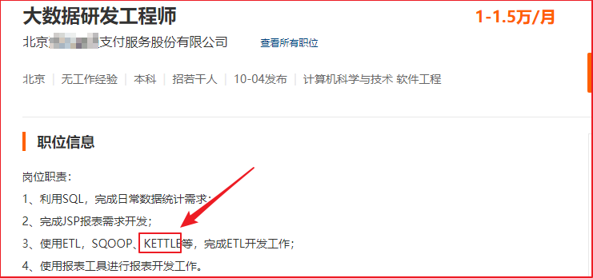

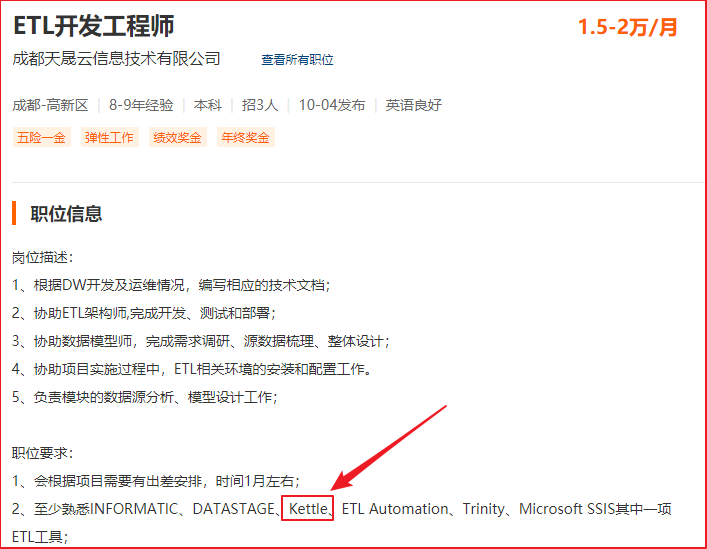

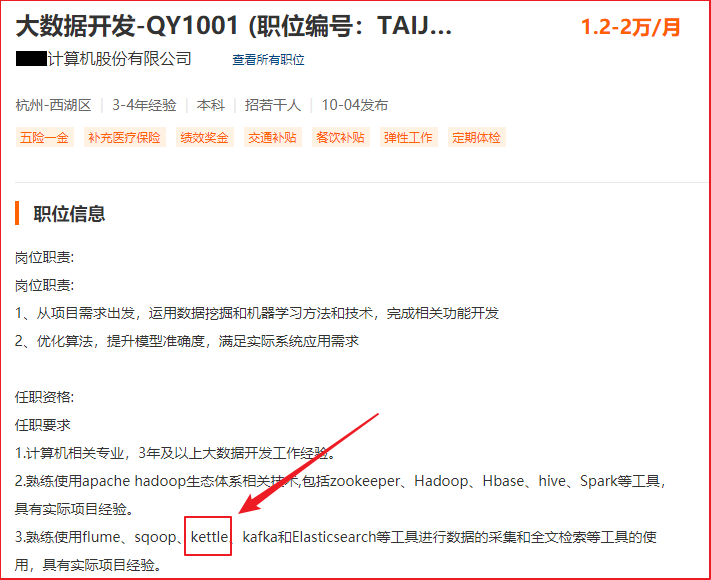

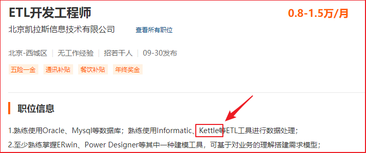

### Kettle安装、配置

环境要求：

* 安装、配置好JDK

1、下载Kettle

* `资料\安装包\pdi-ce-8.2.0.0-342.zip`

2、解压Kettle

| 解压后目录                                                  |
| ----------------------------------------------------------- |
| 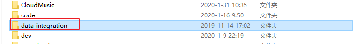 |

3、双击spoon.bat 启动spoon

| 启动脚本                                                    |
| ----------------------------------------------------------- |
| 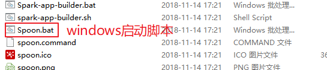 |
| 启动后结果如图                                              |
| 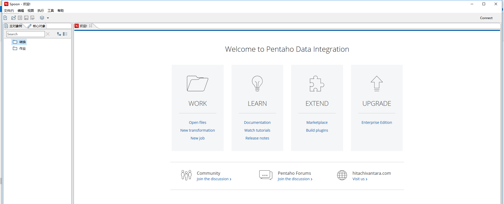 |

#### Kettle入门案例

需求：

* 把数据从CSV文件（ketttle测试数据\用户数据源\user.csv）抽取到Excel文件

数据源：

| id                 | name | age  | gender | province | city   | region   | phone       | birthday   | hobby              | 注册时间            |
| ------------------ | ---- | ---- | ------ | -------- | ------ | -------- | ----------- | ---------- | ------------------ | ------------------- |
| 392456197008193000 | 张三 | 20   | 0      | 北京市   | 昌平区 | 回龙观   | 18589407692 | 1970-08-19 | 美食;篮球;足球     | 2018-08-06 09:44:43 |
| 267456198006210000 | 李四 | 25   | 1      | 河南省   | 郑州市 | 郑东新区 | 18681109672 | 1980-06-21 | 音乐;阅读;旅游     | 2017-04-07 09:14:13 |
| 892456199007203000 | 王五 | 24   | 1      | 湖北省   | 武汉市 | 汉阳区   | 18798009102 | 1990-07-20 | 写代码;读代码;算法 | 2016-06-08 07:34:23 |
| 492456198712198000 | 赵六 | 26   | 2      | 陕西省   | 西安市 | 莲湖区   | 18189189195 | 1987-12-19 | 购物;旅游          | 2016-01-09 19:15:53 |
| 392456197008193000 | 张三 | 20   | 0      | 北京市   | 昌平区 | 回龙观   | 18589407692 | 1970-08-19 | 美食;篮球;足球     | 2018-08-06 09:44:43 |
| 392456197008193000 | 张三 | 20   | 0      | 北京市   | 昌平区 | 回龙观   | 18589407692 | 1970-08-19 | 美食;篮球;足球     | 2018-08-06 09:44:43 |

实现步骤：

1、在Kettle中新建转换

2、拖拽一个CSV输入组件、一个Excel输出组件、并按住Shift拖动鼠标连接两个组件

3、配置CSV输入组件、Excel输出组件

具体实现：

1、新建转换

| 新建转换                                                    |
| ----------------------------------------------------------- |
| 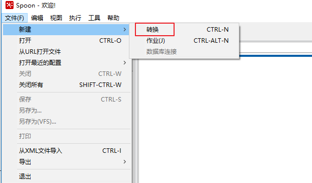 |

2、拖拽一个CSV输入组件、一个Excel输出组件、并按住Shift拖动鼠标连接两个组件

| 组件架构图                              |
| --------------------------------------- |
|  |

3、配置CSV输入组件

* 选择要进行导入的CSV数据源
* 点击 「获取字段」，读取CSV中的列
* 点击  「预览」，浏览CSV中的数据

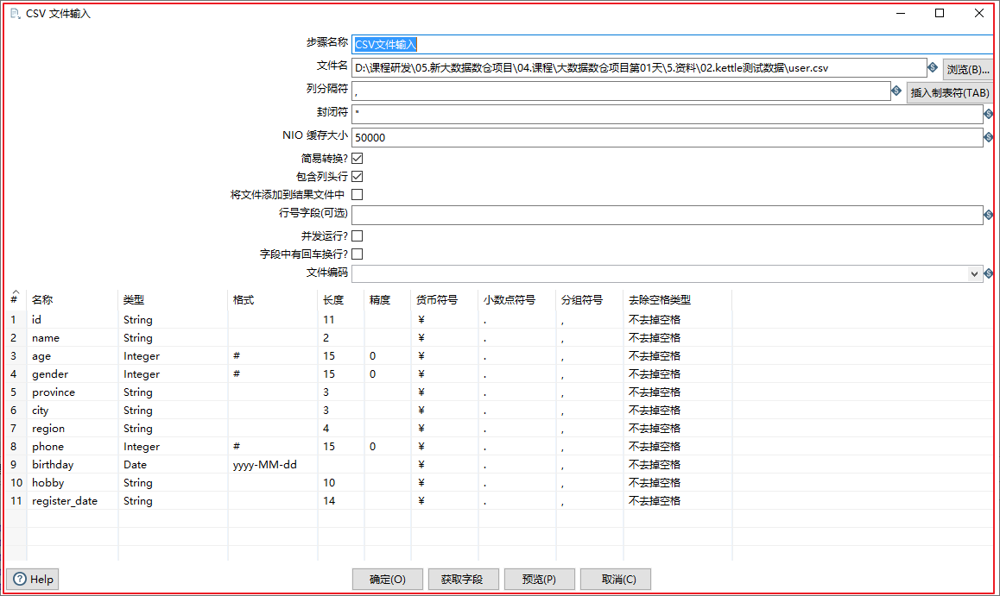

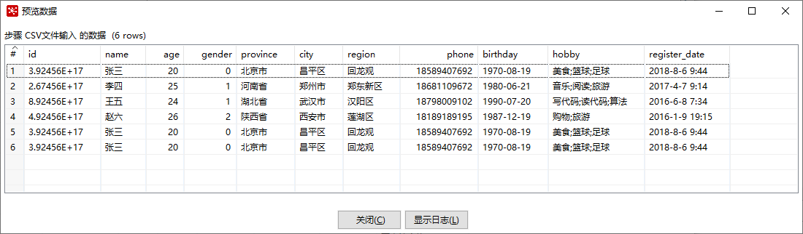

4、配置Excel组件

| 指定输出Excel文件的位置                          |
| ------------------------------------------------ |
| 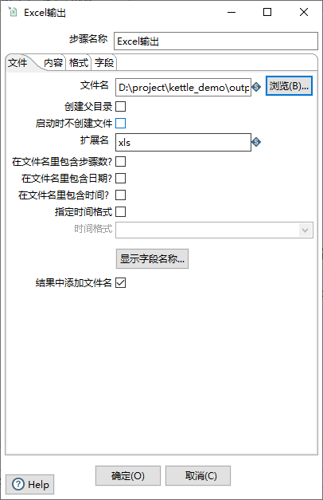 |

5、点击 三角形 箭头执行

| 执行                                                         |
| ------------------------------------------------------------ |
| 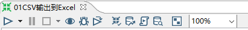 |

#### Kettle数据流结构图

| kettle数据流结构图                      |
| --------------------------------------- |
| 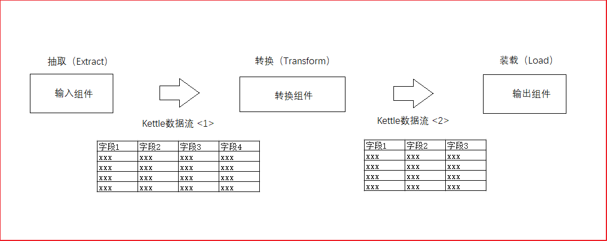 |

##  Kettle输入/输出组件

###  输入组件

####  JSON数据文件输入

需求：

- 将 `资料\kettle测试数据\用户数据源\user.json` 数据文件，通过Kettle，抽取到Excel中

  | json数据格式                            |
  | --------------------------------------- |
  | 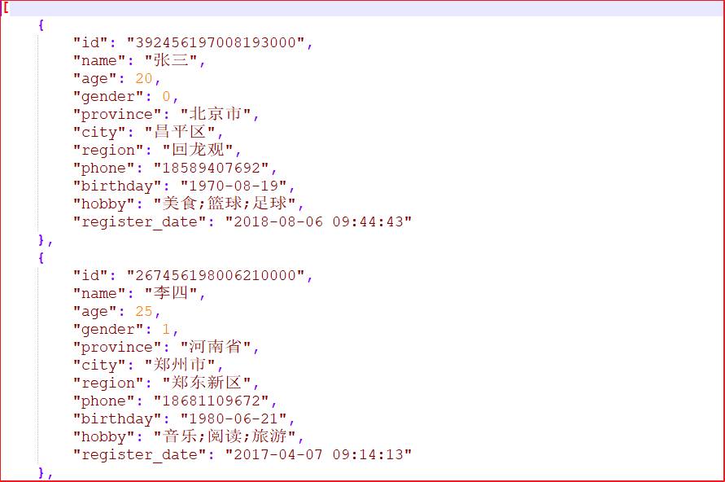 |

  

操作步骤：

1、新建转换

2、拽入 JSON input组件、Microsoft Excel输出组件、并连接两个组件

| 组件架构图                                                   |
| ------------------------------------------------------------ |
|  |

3、配置 JSON input 组件

| ① 指定JSON文件数据源                             |
| ------------------------------------------------ |
| 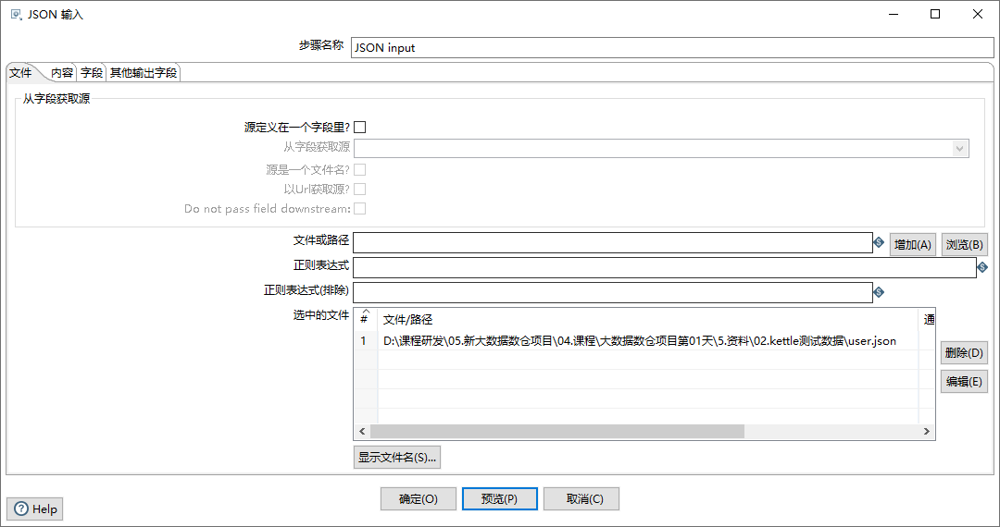          |
| ② 选择 JSON 字段                                 |
| 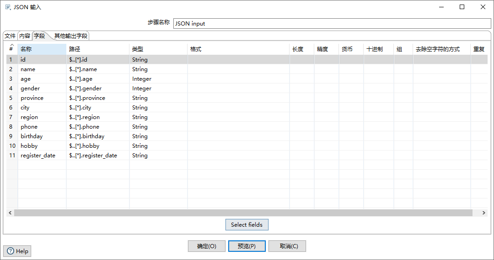          |
| 3、配置 Excel 输出 组件                          |
| 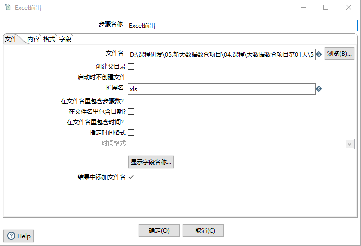 |

5、启动执行

#### 表输入

需求：

- 将MySQL数据库中的 user 表中的数据抽取到Excel文件中

环境准备：

一、Kettle整合MySQL数据库

1、将资料中的 MySQL jdbc 驱动包导入到 pdi-ce-8.2.0.0-342\data-integration\lib 中

2、重启 Kettle

二、MySQL建库

1、导入 `资料\kettle测试数据\用户数据源\test_t_user.sql` 到 MySQL数据库中

| 准备测试数据源                                   |
| ------------------------------------------------ |
| 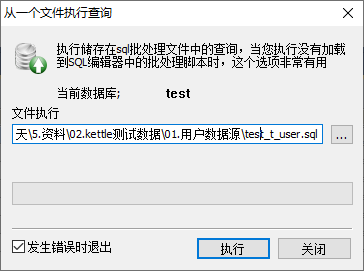 |

实现步骤：

1、拉动 输入/表输入 、输出/Excel输出 组件、连接两个组件

2、配置表输入

3、配置Excel输出组件

具体操作：

1、拉动 输入/表输入 、输出/Excel输出 组件、连接两个组件

2、配置表输入

2.1 新建数据库连接

| kettle新建数据库连接                    |
| --------------------------------------- |
| 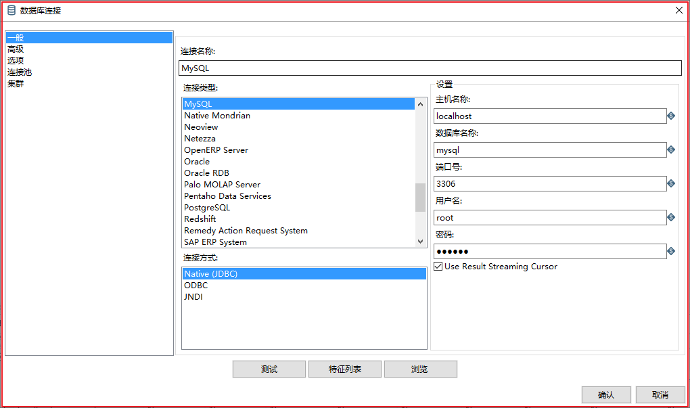 |

2.2 选择 t_user 表，并获取SQL查询语句

| 编写sql语句                             |
| --------------------------------------- |
| 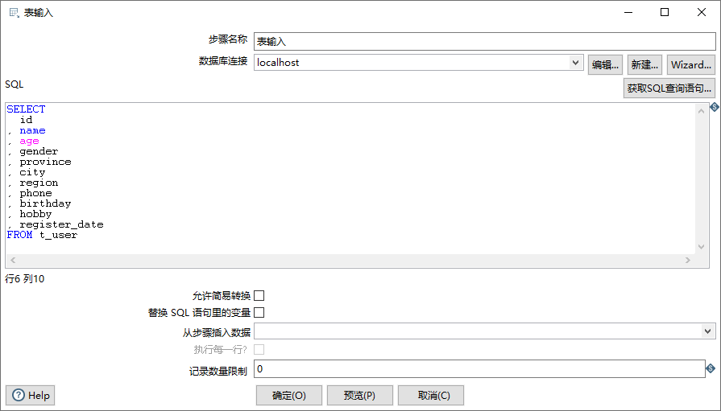 |

2.3 预览数据

| 预览数据                                |
| --------------------------------------- |
| 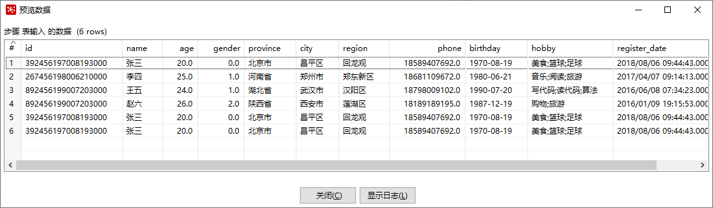 |

**注意：创建一个共享的数据库连接操作步骤**

| 主对象树--》DB连接                                          |
| ----------------------------------------------------------- |
| 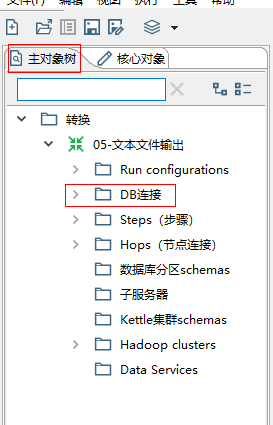 |

| 新建连接                                                    |
| ----------------------------------------------------------- |
|  |

| 设置连接共享                                                |
| ----------------------------------------------------------- |
| 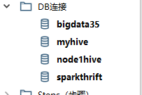 |

鼠标右键--》共享；字体变粗后该连接可以全局使用！

3、配置Excel输出组件

* 指定Excel输出位置

  | 指定excel输出位置                                |
  | ------------------------------------------------ |
  | 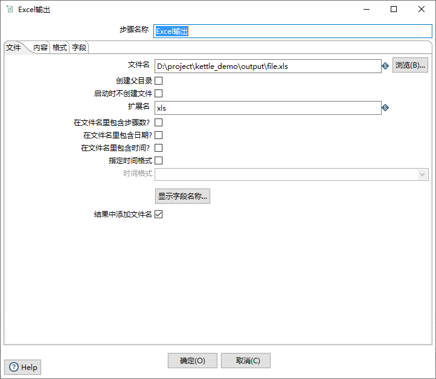 |

  

####  生成记录

数据仓库中绝大多数的数据都是业务系统生成的动态数据，但是其中一部分维度数据不是动态的，比如：日期维度。静态维度数据就可以提前生成。

需求：

- 往 Excel 文件中插入1000条记录：id为1，name为itheima，age为18

操作步骤：

1、拖入 输入/生成记录 组件、输出/Excel输出 组件、连接两个组件

2、配置生成记录组件

3、配置Excel输出

具体实现：

1、拖入 输入/生成记录 组件、输出/Excel输出 组件、连接两个组件

| 组件配置图                                                   |
| ------------------------------------------------------------ |
|  |

2、配置生成记录组件

| 生成记录组件                            |
| --------------------------------------- |
| 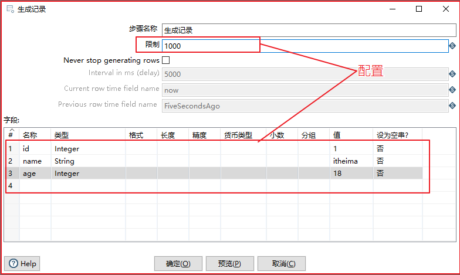 |

### 输出组件

#### 文本文件输出

需求：

- 从mysql数据库的test库的t_user表 抽取数据到文本文件中

步骤：

1、拖入 一个 输入/表输入、一个 输出/文本文件输出、并连接两个组件

| 组件配置图                                                   |
| ------------------------------------------------------------ |
|  |

2、指定 从哪个表中获取数据

3、指定表中的数据输出到哪个文件

#### 表输出

* 表输出就是把数据写入指定的表

需求：

- 从 `资料\kettle测试数据\用户数据源\user.json`中读取id, name, age字段的数据，
- 装载到mysql数据库的 t_user_1 表中

操作步骤：

1、拖动 输入/JSON Input组件 ，输出/表输出，连接两个组件

2、JSON输入配置

3、表输出配置

具体操作：

1、拖动 输入/JSON Input组件 ，输出/表输出，连接两个组件

| 组件配置图                              |
| --------------------------------------- |
|  |

2、JSON输入配置

| json输入配置图                          |
| --------------------------------------- |
| 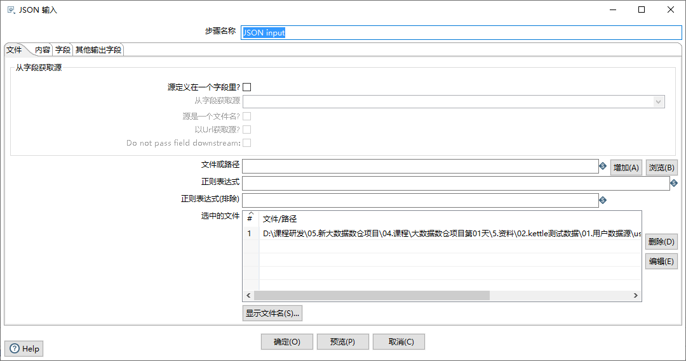 |

3、表输出配置

| 表输出配置                              |
| --------------------------------------- |
| 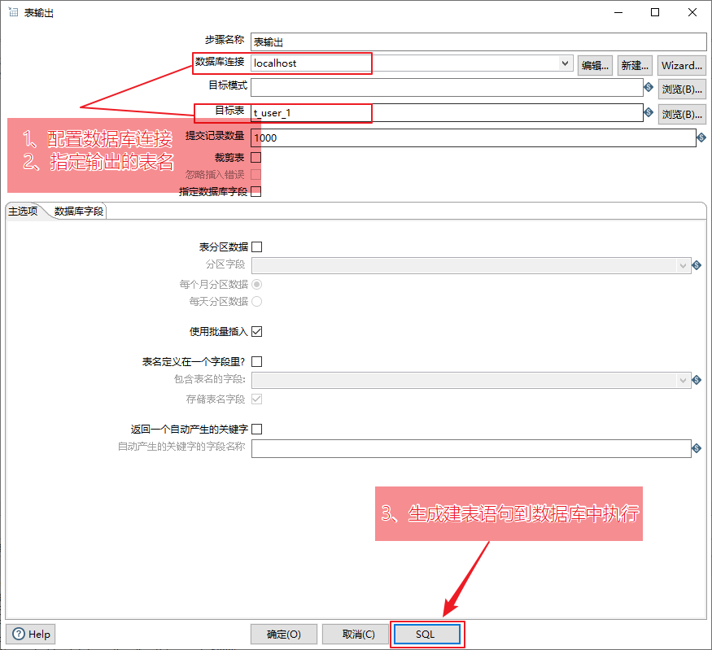 |

####  插入更新

* 插入更新就是把数据库已经存在的记录与数据流里面的记录进行比对
  * 如果不同就进行更新
  * 如果记录不存在，则会插入数据

需求：

- 从`资料\kettle测试数据\user_new.json` 中读数据，并插入或更新到mysql数据库的 t_user_1 表中

操作步骤：

1、拖入一个 输入/JSON输入组件，一个 输出/插入更新组件、连接两个组件

2、配置 JSON输入组件

3、配置 插入更新 组件

4、启动执行

具体实现：

1、拖入一个 输入/JSON输入组件，一个 输出/插入更新组件、连接两个组件

| 组件配置图                              |
| --------------------------------------- |
|  |

2、配置 JSON输入组件

| json输入组件                            |
| --------------------------------------- |
| 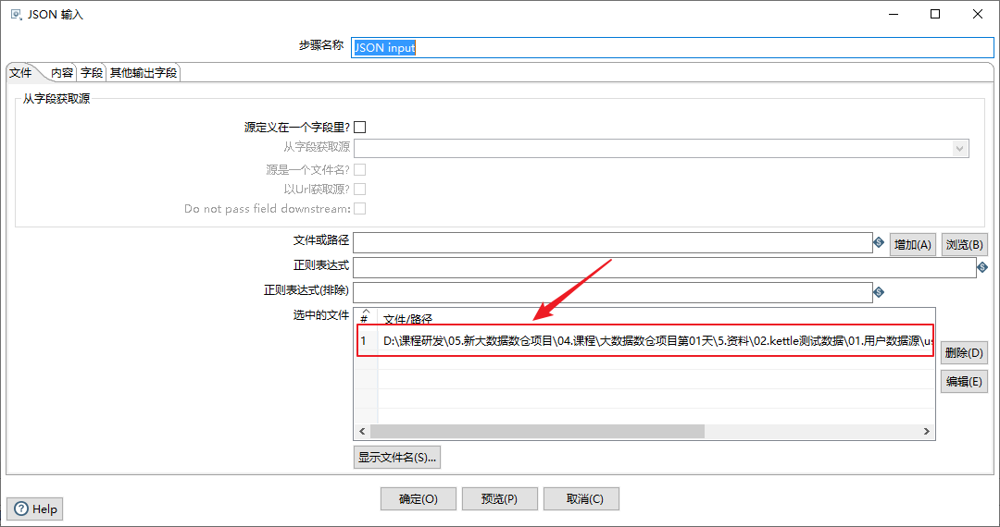 |

3、配置 插入更新 组件

| 插入更新组件                            |
| --------------------------------------- |
| 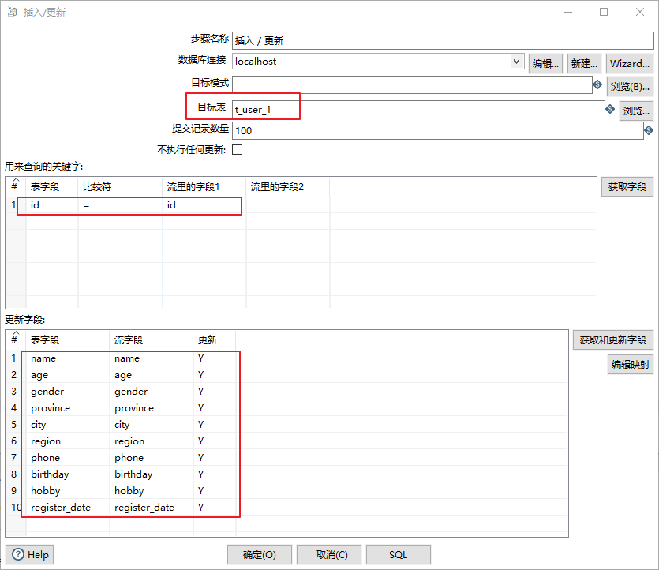 |

4、启动执行

####  删除

需求：

- 从mysql数据库 t_user_1 表中删除指定id为 492456198712198000 的数据

操作步骤：

1、拖入一个 输入/自定义常量数据、输出/删除 组件

2、连接两个组件

| 组件图                                           |
| ------------------------------------------------ |
|  |

3、配置自定义常量数据组件

| 自定义常量组件                          |
| --------------------------------------- |
|  |

4、配置删除组件

| 配置删除组件                                   |
| ---------------------------------------------- |
| 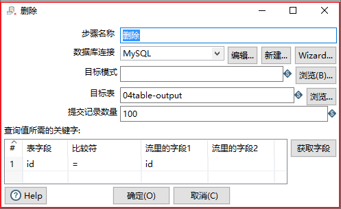 |