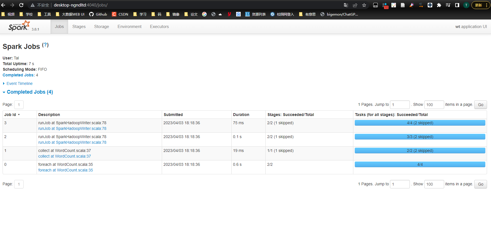
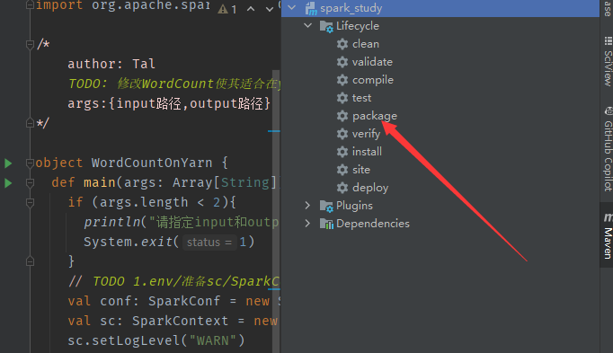
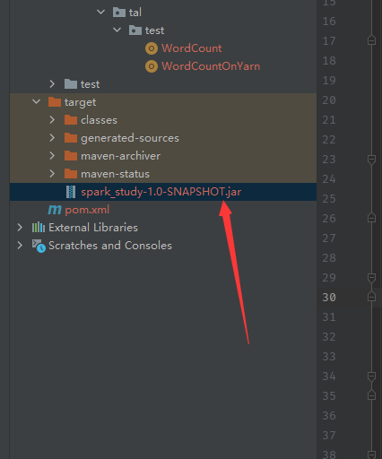

基于idea编程，打成JAR包，使用cluster模式在yarn上运行

# 准备工作

新建一个maven工程，

pom里添加依赖，模板

```xml
<?xml version="1.0" encoding="UTF-8"?>
<project xmlns="http://maven.apache.org/POM/4.0.0"
         xmlns:xsi="http://www.w3.org/2001/XMLSchema-instance"
         xsi:schemaLocation="http://maven.apache.org/POM/4.0.0 http://maven.apache.org/xsd/maven-4.0.0.xsd">
    <modelVersion>4.0.0</modelVersion>

    <groupId>cn.itcast</groupId>
    <artifactId>spark_study</artifactId>
    <version>1.0-SNAPSHOT</version>

    <repositories>
        <repository>
            <id>aliyun</id>
            <url>http://maven.aliyun.com/nexus/content/groups/public/</url>
        </repository>
        <repository>
            <id>apache</id>
            <url>https://repository.apache.org/content/repositories/snapshots/</url>
        </repository>
        <repository>
            <id>cloudera</id>
            <url>https://repository.cloudera.com/artifactory/cloudera-repos/</url>
        </repository>
    </repositories>
    <properties>
        <encoding>UTF-8</encoding>
        <maven.compiler.source>1.8</maven.compiler.source>
        <maven.compiler.target>1.8</maven.compiler.target>
        <scala.version>2.12.11</scala.version>
        <spark.version>3.0.1</spark.version>
        <hadoop.version>3.1.4</hadoop.version>
    </properties>
    <dependencies>
        <!--依赖Scala语言-->
        <dependency>
            <groupId>org.scala-lang</groupId>
            <artifactId>scala-library</artifactId>
            <version>${scala.version}</version>
        </dependency>

        <!--SparkCore依赖-->
        <dependency>
            <groupId>org.apache.spark</groupId>
            <artifactId>spark-core_2.12</artifactId>
            <version>${spark.version}</version>
        </dependency>

        <!-- spark-streaming-->
        <dependency>
            <groupId>org.apache.spark</groupId>
            <artifactId>spark-streaming_2.12</artifactId>
            <version>${spark.version}</version>
        </dependency>

        <!--spark-streaming+Kafka依赖-->
        <dependency>
            <groupId>org.apache.spark</groupId>
            <artifactId>spark-streaming-kafka-0-10_2.12</artifactId>
            <version>${spark.version}</version>
        </dependency>

        <!--SparkSQL依赖-->
        <dependency>
            <groupId>org.apache.spark</groupId>
            <artifactId>spark-sql_2.12</artifactId>
            <version>${spark.version}</version>
        </dependency>

        <!--SparkSQL+ Hive依赖-->
        <dependency>
            <groupId>org.apache.spark</groupId>
            <artifactId>spark-hive_2.12</artifactId>
            <version>${spark.version}</version>
        </dependency>
        <dependency>
            <groupId>org.apache.spark</groupId>
            <artifactId>spark-hive-thriftserver_2.12</artifactId>
            <version>${spark.version}</version>
        </dependency>

        <!--StructuredStreaming+Kafka依赖-->
        <dependency>
            <groupId>org.apache.spark</groupId>
            <artifactId>spark-sql-kafka-0-10_2.12</artifactId>
            <version>${spark.version}</version>
        </dependency>

        <!-- SparkMlLib机器学习模块,里面有ALS推荐算法-->
        <dependency>
            <groupId>org.apache.spark</groupId>
            <artifactId>spark-mllib_2.12</artifactId>
            <version>${spark.version}</version>
        </dependency>

        <dependency>
            <groupId>org.apache.hadoop</groupId>
            <artifactId>hadoop-client</artifactId>
            <version>3.1.4</version>
        </dependency>

        <dependency>
            <groupId>com.hankcs</groupId>
            <artifactId>hanlp</artifactId>
            <version>portable-1.7.7</version>
        </dependency>

        <dependency>
            <groupId>mysql</groupId>
            <artifactId>mysql-connector-java</artifactId>
            <version>5.1.38</version>
        </dependency>

        <dependency>
            <groupId>redis.clients</groupId>
            <artifactId>jedis</artifactId>
            <version>2.9.0</version>
        </dependency>

        <dependency>
            <groupId>com.alibaba</groupId>
            <artifactId>fastjson</artifactId>
            <version>1.2.47</version>
        </dependency>

        <dependency>
            <groupId>org.projectlombok</groupId>
            <artifactId>lombok</artifactId>
            <version>1.18.2</version>
            <scope>provided</scope>
        </dependency>
        <dependency>
            <groupId>com.google.guava</groupId>
            <artifactId>guava</artifactId>
            <version>23.6-jre</version>
        </dependency>
        <dependency>
            <groupId>org.apache.httpcomponents</groupId>
            <artifactId>httpcore</artifactId>
            <version>4.4.8</version>
        </dependency>
    </dependencies>

    <build>
        <sourceDirectory>src/main/scala</sourceDirectory>
        <pluginManagement>
            <plugins>
                <!-- 指定编译java的插件 -->
                <plugin>
                    <groupId>org.apache.maven.plugins</groupId>
                    <artifactId>maven-compiler-plugin</artifactId>
                    <version>3.5.1</version>
                </plugin>
                <!-- 指定编译scala的插件 -->
                <plugin>
                    <groupId>net.alchim31.maven</groupId>
                    <artifactId>scala-maven-plugin</artifactId>
                    <version>3.2.2</version>
                    <executions>
                        <execution>
                            <goals>
                                <goal>compile</goal>
                                <goal>testCompile</goal>
                            </goals>
                            <configuration>
                                <args>
                                    <arg>-dependencyfile</arg>
                                    <arg>${project.build.directory}/.scala_dependencies</arg>
                                </args>
                            </configuration>
                        </execution>
                    </executions>
                </plugin>
                <plugin>
                    <groupId>org.apache.maven.plugins</groupId>
                    <artifactId>maven-surefire-plugin</artifactId>
                    <version>2.18.1</version>
                    <configuration>
                        <useFile>false</useFile>
                        <disableXmlReport>true</disableXmlReport>
                        <includes>
                            <include>**/*Test.*</include>
                            <include>**/*Suite.*</include>
                        </includes>
                    </configuration>
                </plugin>
                <plugin>
                    <groupId>org.apache.maven.plugins</groupId>
                    <artifactId>maven-shade-plugin</artifactId>
                    <version>2.3</version>
                    <executions>
                        <execution>
                            <phase>package</phase>
                            <goals>
                                <goal>shade</goal>
                            </goals>
                            <configuration>
                                <filters>
                                    <filter>
                                        <artifact>*:*</artifact>
                                        <excludes>
                                            <exclude>META-INF/*.SF</exclude>
                                            <exclude>META-INF/*.DSA</exclude>
                                            <exclude>META-INF/*.RSA</exclude>
                                        </excludes>
                                    </filter>
                                </filters>
                                <transformers>
                                    <transformer
                                            implementation="org.apache.maven.plugins.shade.resource.ManifestResourceTransformer">
                                        <mainClass></mainClass>
                                    </transformer>
                                </transformers>
                            </configuration>
                        </execution>
                    </executions>
                </plugin>
            </plugins>
        </pluginManagement>
    </build>

</project>
```

在src/main/目录下新建scala目录，并右键设为源路径（Source Root）

```scala
//TODO 0.env/创建环境

//TODO 1.source/加载数据/创建RDD

//TODO 2.transformation/数据操作/转换

//TODO 3.sink/输出

//TODO 4.关闭资源

```


scala example

```scala
package com.tal.test

import org.apache.spark.rdd.RDD
import org.apache.spark.{SparkConf, SparkContext}

/*
    author: Tal
    TODO: 演示入门案例
*/

object WordCount {
  def main(args: Array[String]): Unit = {
    // TODO 1.env/准备sc/SparkContext(Spark上下文执行环境)
    val conf: SparkConf = new SparkConf().setAppName("wt").setMaster("local[*]")
    val sc: SparkContext = new SparkContext(conf)
    sc.setLogLevel("WARN")

    // TODO 2.source/读取数据
    // RDD:A Resilient Distributed Dataset (RDD):弹性分布式数据集,
    // 简单理解为分布式集合!使用起来和普通集合一样简单!
    // RDD[就是一行行的数据]
    val lines: RDD[String] = sc.textFile("data/input/words.txt")

    // TODO 3.transformation/数据操作/转换
    // 切割:RDD[一个个的单词]
    val words: RDD[String] = lines.flatMap(_.split(" "))
    // 记为1:RDD[(单词, 1)]
    val wordAddOnes: RDD[(String, Int)] = words.map((_, 1))
    // 分组聚合:groupBy + mapValues(_.map(_._2).reduce(_+_))
    // ===>在Spark里面分组+聚合一步搞定:reduceByKey
    val result: RDD[(String, Int)] = wordAddOnes.reduceByKey(_ + _)

    // TODO 4.sink/输出
    // 直接输出
    result.foreach(println)
    // 收集为本地集合再输出
    println(result.collect().toBuffer)
    // 输出到指定path(可以是文件/夹)
    result.repartition(1).saveAsTextFile("data/output/result")
    result.repartition(2).saveAsTextFile("data/output/result2")

    // 为了便于查看Web-UI可以让程序睡一会
    Thread.sleep(1000 * 60)

    // TODO 5.关闭资源
    sc.stop()
  }

}

```



# OnYarn

```scala
package com.tal.test

import org.apache.spark.rdd.RDD
import org.apache.spark.{SparkConf, SparkContext}

/*
    author: Tal
    TODO: 修改WordCount使其适合在yarn集群上运行
    args:{input路径,output路径}
*/

object WordCountOnYarn {
  def main(args: Array[String]): Unit = {
    if (args.length < 2){
      println("请指定input和output")
      System.exit(1)    //非0表示非正常退出程序
    }
    // TODO 1.env/准备sc/SparkContext(Spark上下文执行环境)
    val conf: SparkConf = new SparkConf().setAppName("wc") //.setMaster("local[*]")
    val sc: SparkContext = new SparkContext(conf)
    sc.setLogLevel("WARN")

    // TODO 2.source/读取数据
    // RDD:A Resilient Distributed Dataset (RDD):弹性分布式数据集,
    // 简单理解为分布式集合!使用起来和普通集合一样简单!
    // RDD[就是一行行的数据]
    val lines: RDD[String] = sc.textFile(args(0))//提交任务时指定input参数

    // TODO 3.transformation/数据操作/转换
    // 切割:RDD[一个个的单词]
    val words: RDD[String] = lines.flatMap(_.split(" "))
    // 记为1:RDD[(单词, 1)]
    val wordAddOnes: RDD[(String, Int)] = words.map((_, 1))
    // 分组聚合:groupBy + mapValues(_.map(_._2).reduce(_+_))
    // ===>在Spark里面分组+聚合一步搞定:reduceByKey
    val result: RDD[(String, Int)] = wordAddOnes.reduceByKey(_ + _)

    // TODO 4.sink/输出
    // 直接输出
    // result.foreach(println)
    // 收集为本地集合再输出
    // println(result.collect().toBuffer)
    // 输出到指定path(可以是文件/夹)
    // 如果设计HDFS权限问题，不能写入，需执行：
    // hadoop fs -chmod -R 777 并添加下列代码
    System.setProperty("HADOOP_USER_NAME","root")
    result.repartition(1).saveAsTextFile(args(1))

    // 为了便于查看Web-UI可以让程序睡一会
    // Thread.sleep(1000 * 60)

    // TODO 5.关闭资源
    sc.stop()
  }
}

```

编写好程序，打包package(包含了clean，compile，package)





改名后上传到linux

```shell
SPARK_HOME=/software/spark
${SPARK_HOME}/bin/spark-submit \
--master yarn \
--deploy-mode cluster \
--driver-memory 512m \
--executor-memory 512m \
--class com.tal.test.WordCountOnYarn \
/root/wc.jar \
hdfs://master:9000/wordcount/input/words.txt \
hdfs://master:9000/wordcount/output001

spark-submit \
--master yarn \
--deploy-mode cluster \
--driver-memory 512m \
--executor-memory 512m \
--class com.tal.test.WordCountOnYarn \
/root/wc.jar \
hdfs://master:9000/wordcount/input/words.txt \
hdfs://master:9000/wordcount/output001
```

中途遇见的问题

```shell
java.lang.ClassNotFoundException: com.tal.test.WordCountOnYarn
# 可能存在的原因是 打包前clean把build生成的class给清掉了
# 解决方法：项目重新build之后，直接点击package
```

```shell
ERROR yarn.Client: Application diagnostics message: User class threw exception: java.net.ConnectException: Call From slave2/192.168.197.103 to master:8020 failed on connection exception: java.net.ConnectException: 拒绝连接;

#spark连接HDFS时直接报错，可能是hadoop中core-site.xml配置的集群端口是9000，而spark写的是8020，改为9000即可。
```

 ```shell
  org.apache.hadoop.mapred.FileAlreadyExistsException: Output directory hdfs://master:9000/wordcount/output001
  already exists
 # 已经删除输出目录了但是一直提示输出路径已存在
 
 # 调试发现本地scala版本问题，版本全部统一为2.12解决
 ```


