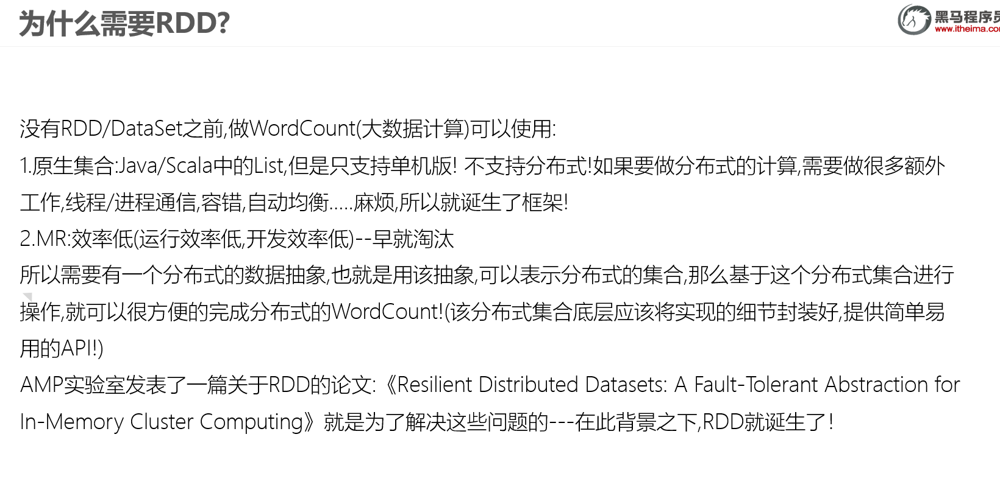
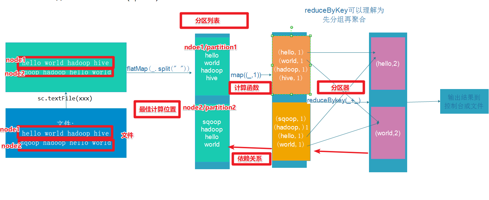
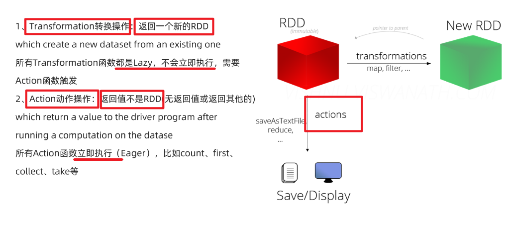
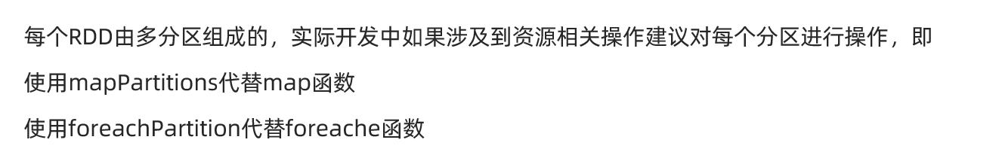

# RDD详解

## why?



List只支持单机，RDD支持分布式

## what?

A Resilient Distributed Dataset (RDD), the basic abstraction in Spark. 

RDD:弹性分布式数据集,是Spark中最基本的数据抽象,用来表示分布式集合,支持分布式操作!由分区组成


## 五大属性

Internally, each RDD is characterized by five main properties:

 - 分区列表: A list of partitions

 - 计算函数: A function for computing each split（函数作用在每个小分区）

 - 依赖关系: A list of dependencies on other RDDs

 - 分区器: Optionally, a Partitioner for key-value RDDs (e.g. to say that the RDD is hash-partitioned)

 - 计算位置：Optionally, a list of preferred locations to compute each split on (e.g. block locations for
   an HDFS file)

   

## WordCount中的RDD的五大属性




# RDD的创建

RDD中的数据可以来源于2个地方：本地集合或外部数据源


```java 
package com.tal.core

import org.apache.spark.rdd.RDD
import org.apache.spark.{SparkConf, SparkContext}

/*
    author: Tal
    TODO: 
*/

object RDD_01 {
  def main(args: Array[String]): Unit = {
    //TODO 0.env/创建环境
    val conf: SparkConf = new SparkConf().setAppName("spark").setMaster("local[*]")
    val sc: SparkContext = new SparkContext(conf)
    sc.setLogLevel("WARN")

    //TODO 1.source/加载数据/创建RDD
    val rdd1: RDD[Int] = sc.parallelize(1 to 10)       //6
    val rdd2: RDD[Int] = sc.parallelize(1 to 10, 3)   //3

    val rdd3: RDD[Int] = sc.makeRDD(1 to 10)           //6
    val rdd4: RDD[Int] = sc.makeRDD(1 to 10, 4)   //4

    val rdd5: RDD[String] = sc.textFile("data/input/heart.csv")    //2
    val rdd6: RDD[String] = sc.textFile("data/input/heart.csv",5)    //5

    val rdd7: RDD[String] = sc.textFile("data/input")   //3
    val rdd8: RDD[String] = sc.textFile("data/input",5)   //6

    //wholeTextFiles(本地/HDFS文件夹,分区数)


    //TODO 2.transformation/数据操作/转换

    //TODO 3.sink/输出
    println(rdd1.getNumPartitions)
    println(rdd1.partitions.length)
    println(rdd2.getNumPartitions)
    println(rdd3.partitions.length)
    println(rdd4.getNumPartitions)
    println(rdd5.partitions.length)
    println(rdd6.getNumPartitions)
    println(rdd7.partitions.length)
    println(rdd8.getNumPartitions)

    //TODO 4.关闭资源
    sc.stop()

  }

}

```


# RDD操作

## 分类




## 基本算子/操作/方法/API

map

faltMap

filter

foreach

saveAsTextFile

```Java
package cn.itcast.core

import org.apache.commons.lang3.StringUtils
import org.apache.spark.rdd.RDD
import org.apache.spark.{SparkConf, SparkContext}

/**
 * Author itcast
 * Desc 演示RDD的基本操作
 */
object RDDDemo02_Basic {
  def main(args: Array[String]): Unit = {
    //TODO 0.env/创建环境
    val conf: SparkConf = new SparkConf().setAppName("spark").setMaster("local[*]")
    val sc: SparkContext = new SparkContext(conf)
    sc.setLogLevel("WARN")

    //TODO 1.source/加载数据/创建RDD
    val lines: RDD[String] = sc.textFile("data/input/words.txt") //2

    //TODO 2.transformation
    val result: RDD[(String, Int)] = lines.filter(StringUtils.isNoneBlank(_))
      .flatMap(_.split(" "))
      .map((_, 1))
      .reduceByKey(_ + _)

    //TODO 3.sink/输出/action
    result.foreach(println)
    result.saveAsTextFile("data/output/result4")
  }
}

```

## 分区操作



```Java
package cn.itcast.core

import org.apache.commons.lang3.StringUtils
import org.apache.spark.rdd.RDD
import org.apache.spark.{SparkConf, SparkContext}

/**
 * Author itcast
 * Desc 演示RDD的分区操作
 */
object RDDDemo03_PartitionOperation {
  def main(args: Array[String]): Unit = {
    //TODO 0.env/创建环境
    val conf: SparkConf = new SparkConf().setAppName("spark").setMaster("local[*]")
    val sc: SparkContext = new SparkContext(conf)
    sc.setLogLevel("WARN")

    //TODO 1.source/加载数据/创建RDD
    val lines: RDD[String] = sc.textFile("data/input/words.txt")

    //TODO 2.transformation
    val result: RDD[(String, Int)] = lines.filter(StringUtils.isNoneBlank(_))
      .flatMap(_.split(" "))
      //.map((_, 1)) //注意:map是针对分区中的每一条数据进行操作
      /*.map(word=>{
        //开启连接--有几条数据就执行几次
        (word,1)
        //关闭连接
      })*/
      // f: Iterator[T] => Iterator[U]
      .mapPartitions(iter=>{//注意:mapPartitions是针对每个分区进行操作
        //开启连接--有几个分区就执行几次
        iter.map((_, 1))//注意:这里是作用在该分区的每一条数据上
        //关闭连接
      })
      .reduceByKey(_ + _)

    //TODO 3.sink/输出/action
    //Applies a function f to all elements of this RDD.
    /*result.foreach(i=>{
      //开启连接--有几条数据就执行几次
      println(i)
      //关闭连接
    })*/
    //Applies a function f to each partition of this RDD.
    result.foreachPartition(iter=>{
      //开启连接--有几个分区就执行几次
      iter.foreach(println)
      //关闭连接
    })


    //result.saveAsTextFile("data/output/result4")
  }
}

```

