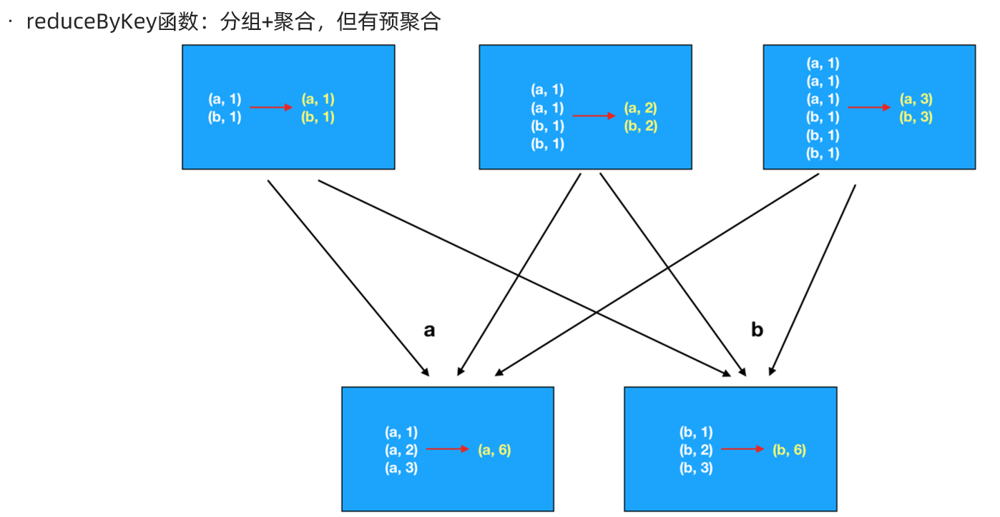

## 重分区操作


```Java
package cn.itcast.core

import org.apache.spark.rdd.RDD
import org.apache.spark.{SparkConf, SparkContext}

/**
 * Author itcast
 * Desc 演示RDD的重分区
 */
object RDDDemo04_RePartition{
  def main(args: Array[String]): Unit = {
    //TODO 0.env/创建环境
    val conf: SparkConf = new SparkConf().setAppName("spark").setMaster("local[*]")
    val sc: SparkContext = new SparkContext(conf)
    sc.setLogLevel("WARN")

    //TODO 1.source/加载数据/创建RDD
    val rdd1: RDD[Int] = sc.parallelize(1 to 10) //8
    //repartition可以增加或减少分区,注意:原来的不变
    val rdd2: RDD[Int] = rdd1.repartition(9)//底层是coalesce(分区数,shuffle=true)
    val rdd3: RDD[Int] = rdd1.repartition(7)
    println(rdd1.getNumPartitions)//8
    println(rdd2.getNumPartitions)//9
    println(rdd3.getNumPartitions)//7

    //coalesce默认只能减少分区,除非把shuffle指定为true,注意:原来的不变
    val rdd4: RDD[Int] = rdd1.coalesce(9)//底层是coalesce(分区数,shuffle=false)
    val rdd5: RDD[Int] = rdd1.coalesce(7)
    val rdd6: RDD[Int] = rdd1.coalesce(9,true)
    println(rdd4.getNumPartitions)//8
    println(rdd5.getNumPartitions)//7
    println(rdd6.getNumPartitions)//9

    //TODO 2.transformation
    //TODO 3.sink/输出
  }
}

```


## 聚合操作


```Java
package cn.itcast.core

import org.apache.spark.rdd.RDD
import org.apache.spark.{SparkConf, SparkContext}

/**
 * Author itcast
 * Desc 演示RDD的聚合-没有key
 */
object RDDDemo05_Aggregate_NoKey{
  def main(args: Array[String]): Unit = {
    //TODO 0.env/创建环境
    val conf: SparkConf = new SparkConf().setAppName("spark").setMaster("local[*]")
    val sc: SparkContext = new SparkContext(conf)
    sc.setLogLevel("WARN")

    //TODO 1.source/加载数据/创建RDD
    val rdd1: RDD[Int] = sc.parallelize(1 to 10) //8
    //TODO 2.transformation

    //TODO 3.sink/输出/Action
    //需求求rdd1中各个元素的和
    println(rdd1.sum())
    println(rdd1.reduce(_ + _))
    println(rdd1.fold(0)(_ + _))
    //aggregate(初始值)(局部聚合, 全局聚合)
    println(rdd1.aggregate(0)(_ + _, _ + _))
    //55.0
    //55
    //55
    //55
  }
}

```


```Java
package cn.itcast.core

import org.apache.commons.lang3.StringUtils
import org.apache.spark.rdd.RDD
import org.apache.spark.{SparkConf, SparkContext}

/**
 * Author itcast
 * Desc 演示RDD的聚合-有key
 */
object RDDDemo06_Aggregate_Key {
  def main(args: Array[String]): Unit = {
    //TODO 0.env/创建环境
    val conf: SparkConf = new SparkConf().setAppName("spark").setMaster("local[*]")
    val sc: SparkContext = new SparkContext(conf)
    sc.setLogLevel("WARN")

    //TODO 1.source/加载数据/创建RDD
    //RDD[一行行的数据]
    val lines: RDD[String] = sc.textFile("data/input/words.txt")

    //TODO 2.transformation
    //RDD[(单词, 1)]
    val wordAndOneRDD: RDD[(String, Int)] = lines.filter(StringUtils.isNoneBlank(_))
      .flatMap(_.split(" "))
      .map((_, 1))
    //分组+聚合
    //groupBy/groupByKey + sum/reduce
    //wordAndOneRDD.groupBy(_._1)
    val grouped: RDD[(String, Iterable[Int])] = wordAndOneRDD.groupByKey()
    //grouped.mapValues(_.reduce(_+_))
    val result: RDD[(String, Int)] = grouped.mapValues(_.sum)
    //reduceByKey
    val result2: RDD[(String, Int)] = wordAndOneRDD.reduceByKey(_+_)
    //foldByKey
    val result3: RDD[(String, Int)] = wordAndOneRDD.foldByKey(0)(_+_)
    //aggregateByKeye(初始值)(局部聚合, 全局聚合)
    val result4: RDD[(String, Int)] = wordAndOneRDD.aggregateByKey(0)(_ + _, _ + _)

    //TODO 3.sink/输出
    result.foreach(println)
    result2.foreach(println)
    result3.foreach(println)
    result4.foreach(println)
  }
}

```


## 面试题:reduceByKey和groupByKey的区别





## 关联操作


```Java
package cn.itcast.core

import org.apache.commons.lang3.StringUtils
import org.apache.spark.rdd.RDD
import org.apache.spark.{SparkConf, SparkContext}

/**
 * Author itcast
 * Desc 演示RDD的join
 */
object RDDDemo07_Join {
  def main(args: Array[String]): Unit = {
    //TODO 0.env/创建环境
    val conf: SparkConf = new SparkConf().setAppName("spark").setMaster("local[*]")
    val sc: SparkContext = new SparkContext(conf)
    sc.setLogLevel("WARN")

    //TODO 1.source/加载数据/创建RDD
    //员工集合:RDD[(部门编号, 员工姓名)]
    val empRDD: RDD[(Int, String)] = sc.parallelize(
      Seq((1001, "zhangsan"), (1002, "lisi"), (1003, "wangwu"))
    )
    //部门集合:RDD[(部门编号, 部门名称)]
    val deptRDD: RDD[(Int, String)] = sc.parallelize(
      Seq((1001, "销售部"), (1002, "技术部"), (1004, "客服部"))
    )

    //TODO 2.transformation
    //需求:求员工对应的部门名称
    val result1: RDD[(Int, (String, String))] = empRDD.join(deptRDD)
    val result2: RDD[(Int, (String, Option[String]))] = empRDD.leftOuterJoin(deptRDD)
    val result3: RDD[(Int, (Option[String], String))] = empRDD.rightOuterJoin(deptRDD)


    //TODO 3.sink/输出
    result1.foreach(println)
    result2.foreach(println)
    result3.foreach(println)
    //(1002,(lisi,技术部))
    //(1001,(zhangsan,销售部))

    //(1002,(lisi,Some(技术部)))
    //(1001,(zhangsan,Some(销售部)))
    //(1003,(wangwu,None))

    //(1004,(None,客服部))
    //(1001,(Some(zhangsan),销售部))
    //(1002,(Some(lisi),技术部))

  }
}

```


## 排序操作

https://www.runoob.com/w3cnote/ten-sorting-algorithm.html

sortBy

sortByKey

top

//需求:求WordCount结果的top3

```Java
package cn.itcast.core

import org.apache.commons.lang3.StringUtils
import org.apache.spark.rdd.RDD
import org.apache.spark.{SparkConf, SparkContext}
import spire.std.tuples

/**
 * Author itcast
 * Desc 演示RDD的排序
 */
object RDDDemo08_Sort {
  def main(args: Array[String]): Unit = {
    //TODO 0.env/创建环境
    val conf: SparkConf = new SparkConf().setAppName("spark").setMaster("local[*]")
    val sc: SparkContext = new SparkContext(conf)
    sc.setLogLevel("WARN")

    //TODO 1.source/加载数据/创建RDD
    //RDD[一行行的数据]
    val lines: RDD[String] = sc.textFile("data/input/words.txt")

    //TODO 2.transformation
    //RDD[(单词, 数量)]
    val result: RDD[(String, Int)] = lines.filter(StringUtils.isNoneBlank(_))
      .flatMap(_.split(" "))
      .map((_, 1))
      .reduceByKey(_ + _)

    //需求:对WordCount的结果进行排序,取出top3
    val sortResult1: Array[(String, Int)] = result
      .sortBy(_._2, false) //按照数量降序排列
      .take(3)//取出前3个

    //result.map(t=>(t._2,t._1))
    val sortResult2: Array[(Int, String)] = result.map(_.swap)
      .sortByKey(false)//按照数量降序排列
      .take(3)//取出前3个

    val sortResult3: Array[(String, Int)] = result.top(3)(Ordering.by(_._2)) //topN默认就是降序

    //TODO 3.sink/输出
    result.foreach(println)
    //(hello,4)
    //(you,2)
    //(me,1)
    //(her,3)
    sortResult1.foreach(println)
    //(hello,4)
    //(her,3)
    //(you,2)
    sortResult2.foreach(println)
    //(4,hello)
    //(3,her)
    //(2,you)
    sortResult3.foreach(println)
    //(hello,4)
    //(her,3)
    //(you,2)

  }
}

```

